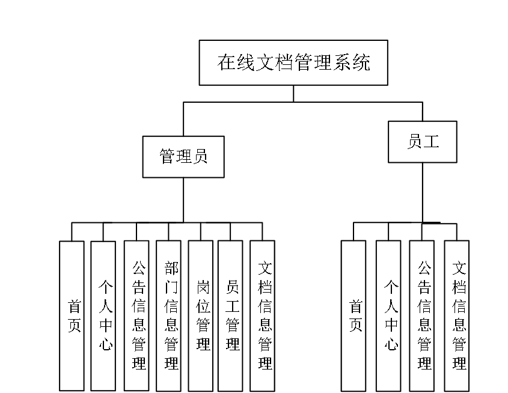
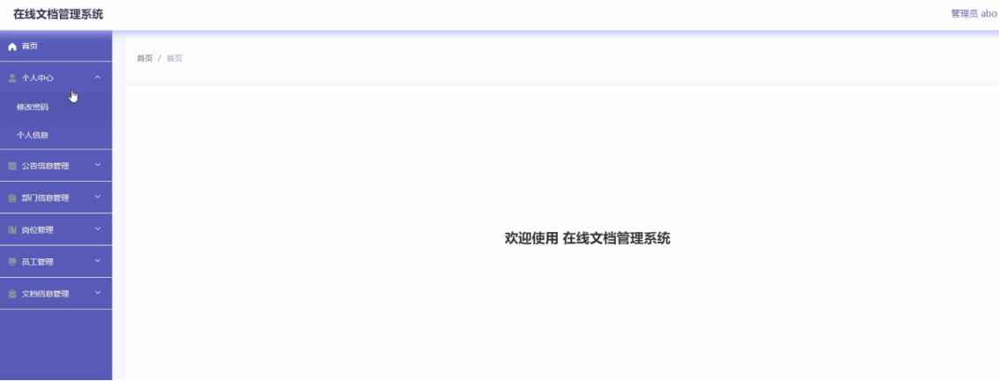
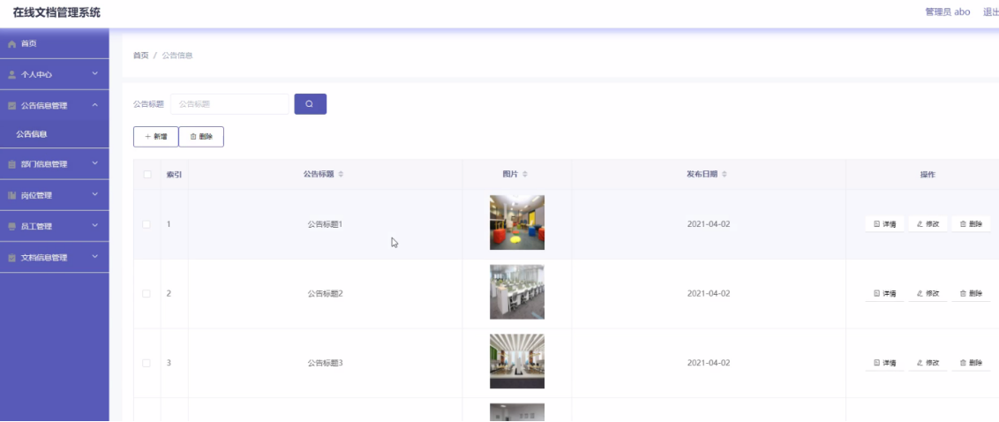
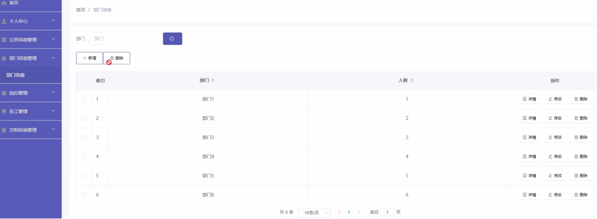
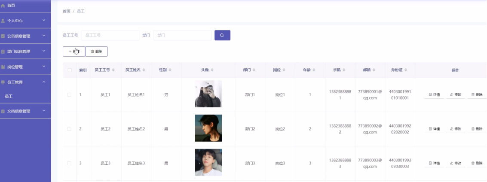
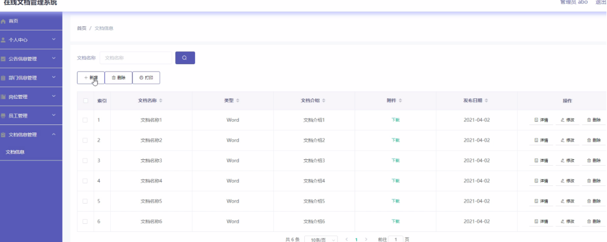
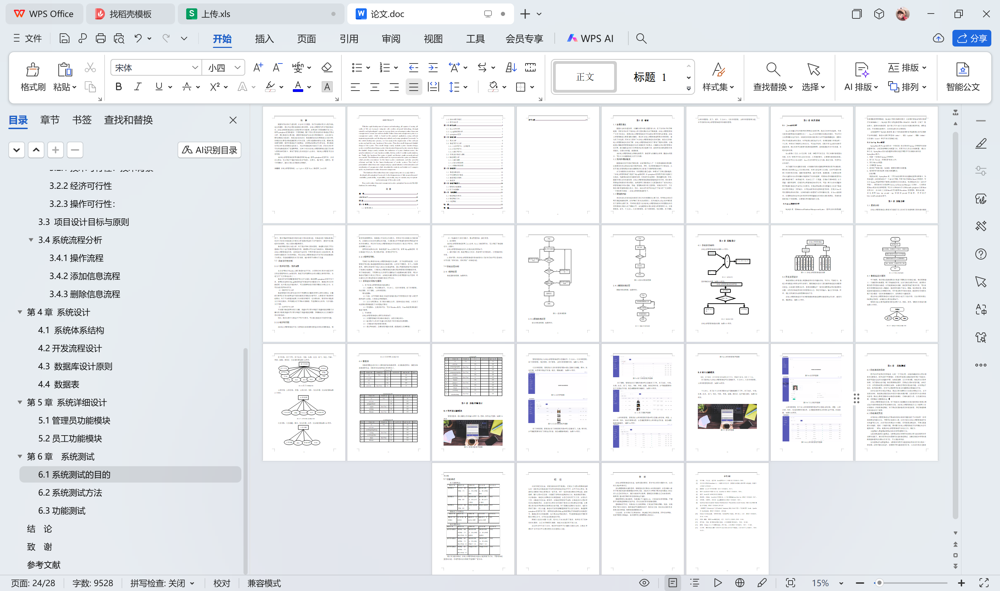

# springboot026-在线文档管理系统的设计与实现

>  博主介绍：
>  Hey，我是程序员Chaers，一个专注于计算机领域的程序员
>  十年大厂程序员全栈开发‍ 日常分享项目经验 解决技术难题与技术推荐 承接各类网站设计，小程序开发，毕设等。
>  【计算机专业课程设计，毕业设计项目，Java，微信小程序，安卓APP都可以做，不仅仅是计算机专业，其它专业都可以】

## 3000套系统可挑选，获取链接：https://chaerspol.github.io/

<b>QQ【获取完整源码】：674456564</b>

<b>QQ群【获取完整源码】：1058861570</b>

### 系统架构

> 前端：html | js | css | jquery | vue
>
> 后端：springboot | mybatis
> 
> 环境：jdk1.8+ | mysql | maven

# 一、内容包括
包括有  项目源码+项目论文+数据库源码+答辩ppt+远程调试成功

# 二、运行环境

> jdk版本：1.8 及以上； ide工具：IDEA； 数据库: mysql5.7及以上；编程语言: Java

# 三、需求分析

**3.1 需求分析**

在线文档管理系统主要是为了提高工作人员的工作效率和更方便快捷的满足员工，更好存储所有数据信息及快速方便的检索功能，对系统的各个模块是通过许多今天的发达系统做出合理的分析来确定考虑员工的可操作性，遵循开发的系统优化的原则，经过全面的调查和研究。
系统所要实现的功能分析，对于现在网络方便的管理，系统要实现员工可以直接在平台上进行查看所有数据信息，根据需求可以进行在线添加，删除或修改在线文档管理系统信息，这样既能节省时间，不用再像传统的方式耽误时间，真的很难去满足员工的各种需求。所以在线文档管理系统的开发不仅仅是能满足员工的需求，还能提高管理员的工作效率，减少原有不必要的工作量。

**3.2 系统可行性分析**

**3.2.1技术可行性：技术背景**

本企业网站在Windows操作系统中进行开发，并且目前PC机的性能已经可以胜任普通网站的web服务器。系统开发所使用的技术也都是自身所具有的，也是当下广泛应用的技术之一。
系统的开发环境和配置都是可以自行安装的，系统使用springboot框架开发工具，使用比较成熟的Mysql数据库进行对系统后台的数据交互，根据技术语言对数据库，结合需求进行修改维护，可以使得网站运行更具有稳定性和安全性，从而完成实现网站的开发。

（1）硬件可行性分析

系统管理及信息分析的设计对于所使用的计算机没有什么硬性的要求，计算机只要可以正常的使用进行代码的编写及页面设计就可行，主要是对于服务器有些要求，对于平台搭建完成要上传的服务器是有一定的要求的，服务器必须选择安全性比较高的，然后就是在打开网站必须顺畅，不能停顿太长时间；性价比高；安全性高。

（2）软件可行性分析

开发整个系统使用的是云计算，流量的可扩展性和基于流量的智能调整云计算的优点就是流量的可扩展性和基于流量的智能调整，保障系统的安全及数据信息的及时备份。
因此，我们从两个方面进行了可行性研究，可以看出系统的开发没有问题。

**3.2.2经济可行性**

在在线文档管理系统开发之前所做的市场调研及其他的相关的管理系统，都是没有任何费用的，都是通过开发者自己的努力，所有的工作的都是自己亲力亲为，在碰到自己比较难以解决的问题，大多是通过同学和指导老师的帮助进行相关信息的解决，所以对于在线文档管理系统的开发在经济上是完全可行的，没有任何费用支出的。
使用比较成熟的技术，系统是基于Java技术的开发，采用Mysql数据库。所以系统在开发人力、财力要求不高，具有经济可行性。

**3.2.3操作可行性** 

可操作性主要是对在线文档管理系统设计完成后，员工的使用体验度，以及管理员可以通过系统随时管理相关的数据信息，并且对于管理员、员工二个权限角色，都可以简单明了的进入到自己的系统界面，通过界面导航菜单可以简单明了地操作功能模块，方便在线文档管理系统的操作需求和管理员管理数据信息，对于系统的操作，不需要专业人员都可以直接进行功能模块的操作管理，所以在系统的可操作性是完全可以的。本系统的操作使用的也是界面窗口进行登录，所以操作人员只要会简单的电脑操作就完全可以的。

**3.3 项目设计目标与原则**

1、关于在线文档管理系统的基本要求

（1）功能要求：可以管理首页、个人中心、公告信息管理、部门信息管理、岗位管理、员工管理、文档信息管理；
等功能模块。

（2）性能：在不同操作系统上均能无差错实现在不同类型的员工登入相应界面后能不出差错、方便地进行预期操作。

（3）安全与保密要求：员工都必须通过注册、登录才能进入系统，并且员工的权限也需要根据员工的类型进行限定。

（4）环境要求：支持多种平台，可在Windows系列、Vista系统等多种操作系统下使用。

2、开发目标

在线文档管理系统的主要开发目标如下：

（1）实现管理系统信息关系的系统化、规范化和自动化；

（2）减少维护人员的工作量以及实现员工对信息的控制和管理。

（3）方便查询信息及管理信息等；

（4）通过网络操作，改善处理问题的效率，提高操作人员利用率；

（5）考虑到员工多样性特点，要求界面简单，操作简便。

3、设计原则

本在线文档管理系统采用Java技术，Mysql数据库开发，充分保证了系统稳定性、完整性。 
在线文档管理系统的设计与实现的设计思想如下： 

（1）操作简单方便、系统界面安全良好、简单明了的页面布局、方便查询相关信息。

（2）即时可见：对在线文档管理系统信息的处理将立马在对应地点可以查询到，从而实现“即时发布、即时见效”的系统功能。 

**3.4系统流程分析**

# 四、功能模块
在线文档管理系统的结构图如下所示

# 五、部分效果图展示
图5-1管理员登录界面图【管理员登录，通过填写注册时输入的用户名、密码、角色进行登录，如图】

图5-2首页界面图【管理员登录进入在线文档管理系统可以查看首页、个人中心、公告信息管理、部门信息管理、岗位管理、员工管理、文档信息管理等信息。如图】

图5-3公告信息管理界面图【公告信息管理，管理员在公告信息管理页面中通过查看公告标题、图片、发布日期、内容等信息进行详情、修改、删除操作，如图】

图5-4部门信息管理界面图【部门信息管理，管理员在部门信息管理页面中可以查看部门、人数、等信息，并可根据需要对部门信息进行详情、修改或删除等操作，如图】

图5-5员工管理界面图【员工管理，管理员在员工管理页面中可以查看员工工号、员工姓名、性别、头像、姓名、部门、岗位、年龄、手机、邮箱、身份证等信息，并可根据需要对员工信息进行详情、修改或删除等详细操作，如图】

图5-6文档信息管理界面图【文档信息管理，管理员在文档信息管理页面中可以查看文档名称、类型、文档介绍、附件、发布日期等内容，并且根据需要对文档信息进行详情、修改或删除等详细操作，如图】

 <b>完整文章</b>

 

## 3000套系统可挑选，获取链接：https://chaerspol.github.io/

<b>QQ【获取完整源码】：674456564</b>

<b>QQ群【获取完整源码】：1058861570</b>

